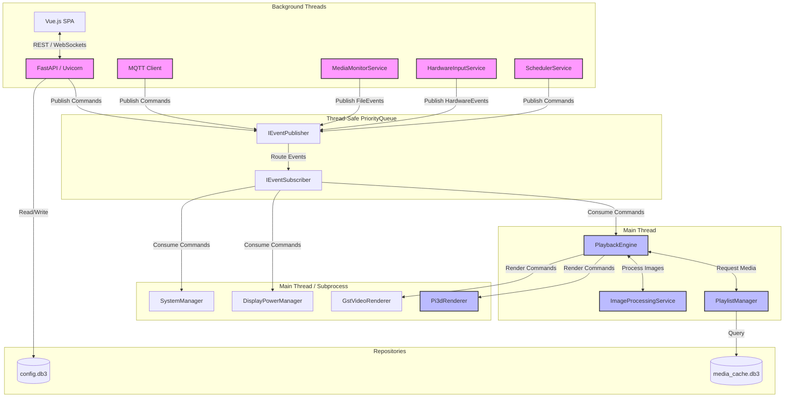
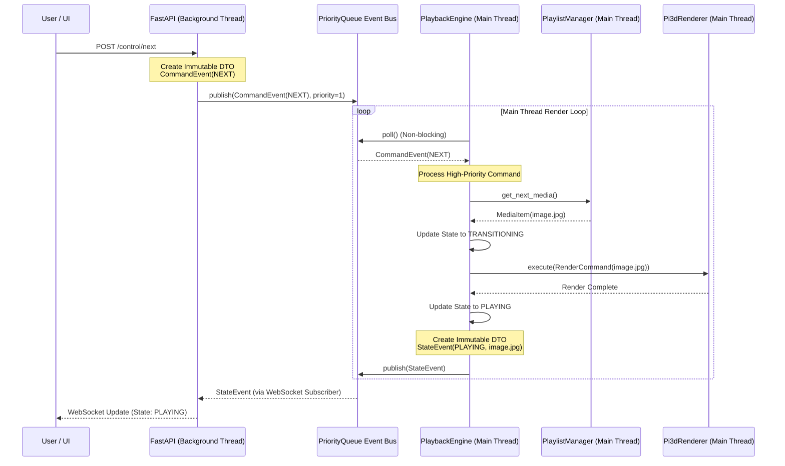
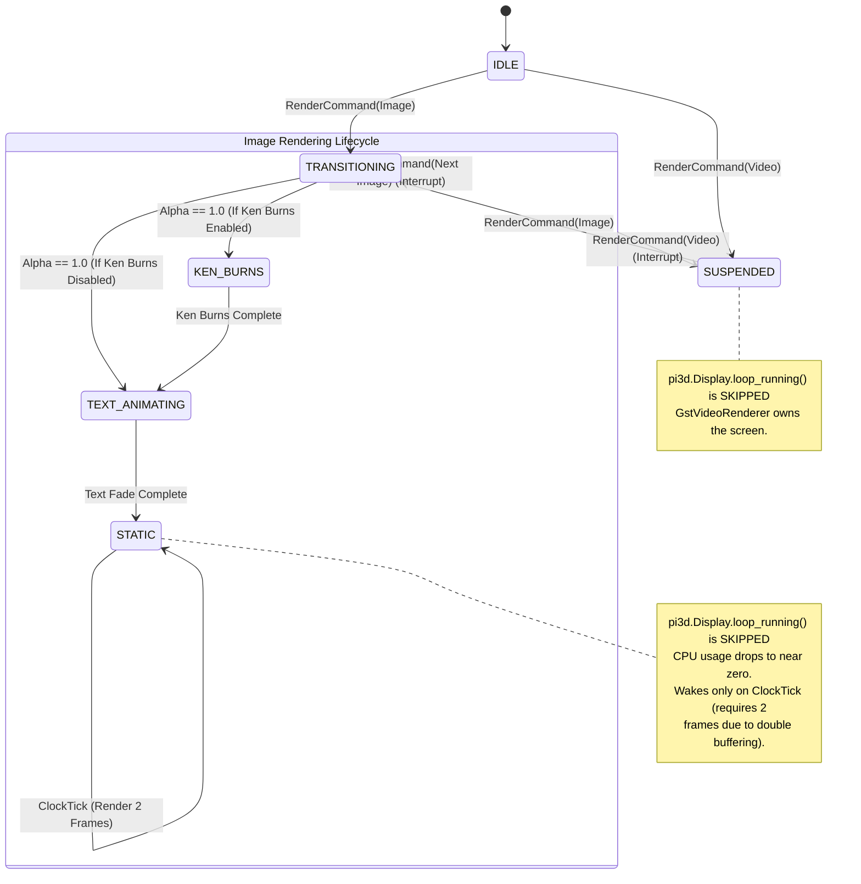

# Architecture Solution Document: Picframe 2.0 Modernization

## 1. Executive Summary
This document outlines the comprehensive architectural redesign of the `picframe` project. The goal is to transition from a tightly coupled, synchronous script to a modern, modular, and highly performant system. This modernization leverages **Clean Architecture (Hexagonal)** and a **Strict Event-Driven Architecture (EDA)** to support dynamic configuration via a FastAPI/Vue.js stack, robust state management, and hardware-accelerated video playback using GStreamer alongside `pi3d` for image transitions.

## 2. Architectural Concept & Reasoning

The Picframe 2.0 architecture is built upon several advanced software design patterns to ensure strict testability, maintainability, and thread safety in a concurrent Python environment.

### 2.1 Clean Architecture (Hexagonal)
*   **Concept:** The system is divided into strict, concentric layers (Domain, Application, Adapters, Infrastructure) where dependencies only point inwards. The core business logic has no knowledge of the UI, databases, or external frameworks.
*   **Reasoning & Benefits:** This decouples the core media orchestration from the presentation and control layers. It allows us to swap out the UI (e.g., Vue.js instead of a local GUI) or the database (SQLite instead of YAML) without touching the core logic. It also enables pure unit testing of the business rules by mocking the outer layers. To enforce this, legacy "God Objects" are dismantled into dedicated services:
    *   **`HardwareInputService` (Control Plane):** Monitors GPIO (PIR sensors, buttons) and publishes `HardwareEvent`s.
    *   **`ImageProcessingService` (Application Layer):** Handles CPU-intensive image matting and caching before rendering.
    *   **`DisplayPowerManager` (Infrastructure Layer):** Manages OS-level screen power (vcgencmd, xset) independently of the pixel renderer.

### 2.2 Strict Event-Driven Architecture (EDA) & PriorityQueue
*   **Concept:** Components communicate exclusively by publishing and subscribing to events via a central Event Bus, implemented using a custom, thread-safe `queue.PriorityQueue`.
*   **Reasoning & Benefits:** In a multithreaded environment where FastAPI and MQTT run in background threads while `pi3d` requires the Main Thread, direct method calls cause blocking and crashes. The Event Bus acts as a safe bridge. The `PriorityQueue` ensures that critical commands (like an immediate user "Pause" or "Next" request) bypass standard background state updates, providing a highly responsive user experience.

### 2.3 Interface Segregation Principle (ISP)
*   **Concept:** The Event Bus does not expose a monolithic interface. Instead, it is split into `IEventPublisher` (for sending events) and `IEventSubscriber` (for receiving events).
*   **Reasoning & Benefits:** This prevents cross-talk and enforces strict boundaries. A component like the FastAPI backend only needs to publish commands and subscribe to state changes; it cannot accidentally consume commands meant for the rendering engine. This makes the contracts between components explicit and easier to mock in tests.

### 2.4 Command Pattern & Immutable DTOs
*   **Concept:** All data passed through the Event Bus is encapsulated in Data Transfer Objects (DTOs) defined as `@dataclass(frozen=True)`.
*   **Reasoning & Benefits:** Immutability guarantees thread safety. Once an event (e.g., `CommandEvent`, `StateEvent`) is created by a background thread, it cannot be altered while sitting in the queue or being processed by the Main Thread. This eliminates race conditions and makes the system's state highly predictable and easy to debug.

### 2.5 Separation of Concerns (SoC): Orchestration
*   **Concept:** The monolithic state machine is split into two distinct components:
    *   **`PlaylistManager`:** Handles media querying, filtering, shuffling, and history.
    *   **`PlaybackEngine`:** Manages the playback state (Playing, Paused, Transitioning) and timing.
*   **Reasoning & Benefits:** Prevents the creation of a "God Object." The `PlaylistManager` can be tested purely for its logic (e.g., "does shuffle work?"), while the `PlaybackEngine` can be tested purely for its state transitions (e.g., "does it pause correctly?"), reducing cognitive load and test complexity.

### 2.6 Dual-Database Strategy (Repository Pattern)
*   **Concept:** Configuration and media metadata are strictly separated into `config.db3` (persistent user settings) and `media_cache.db3` (ephemeral media metadata).
*   **Reasoning & Benefits:** Prevents lifecycle conflicts. Rebuilding the media cache (which happens frequently) will never risk corrupting user configuration. The Repository Pattern abstracts the SQLite implementation, allowing the business logic to interact with simple Python objects rather than SQL queries.

### 2.7 Database Schema Versioning & Migrations
*   **Concept:** Strict versioning is enforced for all database schemas (`config.db3` and `media_cache.db3`). A standardized, code-based migration mechanism (`MigrationManager`) handles schema changes sequentially. Migrations are defined as immutable objects containing a target version and an SQL `up_script`.
*   **Reasoning & Benefits:** Guarantees forward compatibility and data integrity across system updates. By tracking the `schema_version` in a dedicated table and applying sequential SQL migration scripts within a single SQLite transaction, the system can safely upgrade existing databases without data loss or partial schema corruption.

### 2.8 Decoupling Presentation from Domain Logic (SRP)
*   **Concept:** The Presentation Layer (`Pi3dRenderer`) is strictly a "dumb" component responsible only for drawing pixels. It receives a `RenderCommand` and executes it. All domain logic, including metadata extraction and publication, is handled by the `PlaybackEngine`.
*   **Reasoning & Benefits:** Violations of the Single Responsibility Principle (SRP), such as having the render loop extract and publish metadata, cause unpredictable latency and frame drops. By shifting this responsibility to the `PlaybackEngine`, the Main Thread remains unblocked. The `PlaybackEngine` retrieves an immutable `MediaItem` DTO from the `PlaylistManager`, instructs the renderer, and immediately publishes a `MediaChangedEvent` to the Event Bus. Background threads (FastAPI, MQTT) consume this event asynchronously, ensuring network I/O never pollutes the synchronous render loop.

### 2.9 Asynchronous Media Monitoring & Network Share Handling
*   **Concept:** A dedicated `MediaMonitorService` (utilizing `watchdog`) runs in a background thread to detect file system changes (Create, Modify, Delete) in configured media directories. It publishes immutable `FileChangeEvent` DTOs to the Event Bus. To support network shares (NFS/SMB) mounted as subfolders, the service implements a hybrid monitoring strategy: native OS events (`inotify`/`FSEvents`) for local drives, and a configurable `PollingObserver` fallback for detected network mount points.
*   **Reasoning & Benefits:** Eliminates the need for synchronous, blocking directory scans during playback for local files. When a `FileChangeEvent` is consumed by the Media Orchestrator, it asynchronously triggers the `MetadataExtractor` to update the ephemeral `media_cache.db3` and signals the `PlaylistManager` to adjust the active playlist. The hybrid approach ensures the system reacts to new media in real-time on local storage while safely mitigating the limitations of network file systems (which do not reliably propagate inotify events) without crashing the application.
*   **Symlink & Mount Point Traversal:** The service includes explicit configuration to safely follow symlinks (`follow_links=True/False`) and detect mount boundaries. When traversing directories, it checks if a subfolder is a distinct mount point (e.g., using `os.path.ismount()`). If a network mount is detected within a locally monitored directory tree, the service automatically attaches a dedicated `PollingObserver` to that specific subfolder, ensuring comprehensive coverage regardless of the underlying storage topology.

### 2.10 Hardware Abstraction Layer (HAL) & Cross-Platform Ports
*   **Concept:** To support native execution across Raspberry Pi (Wayland) and Ubuntu (VM), OS-specific interactions are abstracted behind strict Port interfaces (e.g., `IDisplayPower`, `IHardwareInput`, `ISystemManager`).
*   **Reasoning & Benefits:** The core application logic must remain OS-agnostic. By defining Ports in the Application layer and implementing OS-specific Adapters in the Infrastructure layer (e.g., `WaylandDisplayPower`, `UbuntuDisplayPower`, `MockHardwareInput`), the Composition Root (`main.py`) can detect the host OS at startup and inject the correct concrete implementation. This prevents `if os.name == '...'` spaghetti code from polluting the domain logic and allows developers to run and test the core engine on Ubuntu without requiring physical Raspberry Pi hardware.
*   **Robust Environment Detection:** To ensure stability across diverse execution environments (bare metal Raspberry Pi vs. generic Linux VMs), the `HALFactory` implements robust runtime detection. It safely probes hardware identifiers (e.g., `/proc/device-tree/model`) and display server variables (`$WAYLAND_DISPLAY`) using exception boundaries. If native hardware or specific CLI tools (like `wlr-randr`) are missing, it gracefully degrades to Mock adapters. This prevents initialization crashes, ensures proper resource management on bare metal, and allows seamless development and testing on VMs.

### 2.11 CLI and Application Initialization
*   **Concept:** The application provides a command-line interface (e.g., `picframe init` and `picframe run --port 9000`). The `init` command bootstraps the user environment in `~/.picframe/` (creating directories, copying default assets, and initializing SQLite databases). It interactively prompts users when existing databases are found, offering to keep or delete them, and supports a `--force` flag for automated environments.
*   **Reasoning & Benefits:** Separates application initialization from runtime execution. Bootstrapping operates strictly in user-space, avoiding the security risks and architectural anti-patterns of executing `sudo` from within Python to install system dependencies. The interactive prompts prevent accidental data loss during re-initialization, while the `--force` flag enables CI/CD and Docker compatibility.

### 2.12 Event-Driven Metadata Broadcasting (CQRS)
*   **Concept:** Image metadata broadcasting is handled via a CQRS pattern. The core domain emits a `CurrentMediaChangedEvent` when the displayed image changes. A dedicated `StateTrackerService` subscribes to this event, maintaining the current system state and exposing an `ISystemStateQuery` port. External delivery mechanisms (MQTT, WebSockets, REST APIs) query this port or subscribe to the event bus directly, completely decoupled from the core domain logic.
*   **Reasoning & Benefits:** This strictly adheres to Hexagonal Architecture by preventing external communication protocols from polluting the domain. It supports both push (MQTT/WebSockets via event subscription) and pull (REST API via state query) models efficiently without duplicating state management logic.

### 2.13 Configuration Mapping and Validation (Anti-Corruption Layer)
*   **Concept:** The system employs a strict separation between how configuration is stored (flat key-value pairs in SQLite) and how it is presented/consumed by the frontend (nested JSON objects). A central `default_config.yaml` file acts as the single source of truth for all base settings. During `picframe init`, the `EnvironmentBootstrapper` reads this YAML, validates it through Pydantic `AppConfig` models, flattens it, and seeds the `config.db3` database. A dedicated Service Layer (`ConfigService`) acts as an Anti-Corruption Layer during runtime, handling the flattening and unflattening of data for API requests.
*   **Reasoning & Benefits:** This enforces Separation of Concerns (SoC) and guarantees a fully populated configuration state from day zero. By seeding the database during initialization, the frontend is guaranteed to receive complete, schema-compliant JSON objects via the `/api/config` endpoint, eliminating the need for scattered hardcoded defaults or frontend fallback logic. Pydantic validation ensures that the database is never polluted with invalid or obsolete configuration keys, maintaining strict alignment with the `configSchema.json` contract.
*   **Renderer Configuration Decoupling:** To prevent infrastructure leakage, the `Pi3dRenderer` does not interact directly with the `IConfigRepository` or raw dictionaries. Instead, the `ConfigService` listens for configuration changes, constructs a strongly-typed, fully validated `RendererConfig` DTO, and publishes a `RendererConfigUpdatedEvent`. The renderer simply receives this immutable DTO and applies it, ensuring strict adherence to the Command Pattern and SRP.

### 2.14 Pi3d Rendering Pipeline & State Machine
*   **Concept:** The monolithic `Pi3dRenderer` is decomposed into specialized, focused rendering components (`ImageRenderer`, `TextRenderer`, `ClockRenderer`, `OverlayRenderer`) that share a single `pi3d.Display` instance. The render loop operates as a formal, lightweight State Machine implemented via a custom Python `Enum` (`RenderState`) and explicit transition handlers, rather than relying on heavy external libraries.
*   **Reasoning & Benefits:**
    *   **Componentization:** Separating concerns makes the rendering logic cleaner and easier to maintain. The `Pi3dRenderer` acts as a facade, delegating specific drawing tasks to `TextRenderer` and `ClockRenderer` based on the `OverlayConfig` DTO received in the `RenderCommand`.
    *   **Lightweight State Machine:** Using a custom `Enum` (e.g., `IDLE`, `TRANSITIONING`, `KEN_BURNS`, `TEXT_ANIMATING`, `STATIC`, `SUSPENDED`) guarantees zero-overhead performance in the critical 60fps render loop. It maintains strict type safety (`mypy` compatibility) and avoids the dynamic dispatch penalties associated with libraries like `transitions`.
    *   **Predictable Transitions:** Replaces complex, fragile conditional blocks with explicit state transitions. For example, `TRANSITIONING` automatically advances to `TEXT_ANIMATING` once the image alpha reaches 1.0, preventing overlapping animations.
    *   **Optimization (The Sleep/Wake Mechanism):** By tracking the overall `RenderState`, the engine can easily identify when the screen is `STATIC`. In this state, it skips `pi3d.Display.loop_running()` and sleeps, drastically reducing CPU load. To support the live clock, the `ClockRenderer` implements a "Dirty Rect/Tick" concept, waking the loop exactly when a minute/second change occurs. Because `pi3d` uses EGL double buffering, the engine must render **two consecutive frames** during this tick to ensure both the front and back buffers contain the updated clock string before returning to sleep.
    *   **Ken Burns Exception:** If the `KEN_BURNS` state is active, the screen is never truly static, and the CPU-saving sleep mechanism is explicitly bypassed.
    *   **Video Suspension:** When the `PlaybackEngine` hands off to the `GstVideoRenderer`, it sends a command to the `Pi3dRenderer` to enter the `SUSPENDED` state, dropping its CPU usage to near zero until the video finishes.
    *   **Local Render Queue:** A local `PriorityQueue` is introduced specifically for the rendering engine. This keeps high-frequency, synchronous render events (like `FadeStepComplete` or `ClockTick`) off the main application `EventBus`, preventing pollution and ensuring the main thread can poll both queues efficiently without blocking.

### 2.15 API Configuration & Network Binding
*   **Concept:** The system distinguishes between *runtime-mutable configuration* (managed via SQLite/YAML and the `/api/config` endpoint) and *startup-only parameters* (managed via CLI arguments and environment variables).
*   **Reasoning & Benefits:**
    *   **Network Binding (Port):** The Uvicorn server port is strictly a startup parameter. Allowing the port to be changed dynamically during runtime would require tearing down and restarting the background server thread, leading to dropped WebSocket connections, interrupted API requests, and potential system instability.
    *   **CORS Configuration:** Cross-Origin Resource Sharing (CORS) origins (`cors_allowed_origins`) are part of the runtime-mutable configuration under the `http` section. The Composition Root (`main.py`) reads this from the `ConfigService` and injects it into the FastAPI application, ensuring the application layer remains decoupled from the configuration storage mechanism.

### 2.16 Geolocation & Reverse Geocoding Architecture
*   **Concept:** A hybrid asynchronous architecture handles reverse geocoding of image GPS coordinates to prevent blocking the main thread and to respect strict external API rate limits (e.g., Nominatim's 1 request per second).
*   **Reasoning & Benefits:**
    *   **Coordinate Rounding & Caching:** During metadata extraction, GPS coordinates are rounded to 4 decimal places (approx. 11m resolution). These rounded coordinates are used as unique keys in a dedicated `locations` SQLite table. This prevents redundant API calls for photos taken in the exact same location.
    *   **Background Worker Queue:** The media indexer extracts raw coordinates and places them in a background queue. A dedicated worker thread consumes this queue, performing reverse geocoding lookups at a strictly rate-limited pace (e.g., 2.0s intervals) and saving the resolved address strings to the `locations` table.
    *   **Just-In-Time (JIT) Fallback:** If an image is selected for playback before the background worker has resolved its coordinates, the `PlaybackEngine` performs a synchronous JIT lookup immediately before display. If this fails (e.g., network error), the engine gracefully falls back to displaying the map without text and flags the coordinate for retry.

## 3. System Diagrams

### 3.1 Component Architecture
This diagram illustrates the strict layers and dependencies of the system, highlighting how the Composition Root wires the application together and how the Event Bus acts as the central nervous system.

### 3.2 Concurrency & Event Flow
This sequence diagram demonstrates the lifecycle and flow of immutable events between the background threads (Control Plane), the Event Bus, and the synchronous Main Thread (Orchestrator & Renderers).

### 3.3 Pi3dRenderer State Machine
This state diagram illustrates the lifecycle of a single image render command within the `Pi3dRenderer`, highlighting the optimization paths for static images and video suspension.

## 4. Gap Analysis Resolutions & Mitigation Strategies

### 4.1 The Main Loop Concurrency Conflict
*   **The Problem:** `pi3d` (OpenGL) must run in the Main Thread. FastAPI/Uvicorn also typically expects the Main Thread. Running both synchronously causes blocking and crashes.
*   **The Mitigation:** The Main Thread is owned exclusively by the `pi3d` render loop and the `PlaybackEngine` event consumer. FastAPI/Uvicorn and the MQTT client run in isolated background threads. The `PriorityQueue` Event Bus bridges them safely.

### 4.2 Legacy Configuration Import Mechanism
Instead of an automatic startup migration, the system provides an explicit, user-triggered import mechanism for legacy `configuration.yaml` files. This is handled via a dedicated backend endpoint (`/api/config/import-yaml`) that parses the YAML, validates it against Pydantic models (ignoring unknown or obsolete fields), and merges the valid settings into the SQLite database. The frontend provides an "Import Legacy YAML" button in the Settings view. This approach standardizes on JSON for general imports/exports while providing a safe, controlled path for legacy users to migrate their settings without risking startup failures or database corruption.

### 4.3 Event Bus "Poison Pill" Handling
To ensure system resilience, the `PlaybackEngine` will implement a global exception boundary. If a corrupted event (e.g., a bad media file) causes an error, the exception is caught, a `SystemErrorEvent` is published (for the UI), and the state machine resets to `IDLE`, preventing the Main Thread from crashing.

### 4.4 Dynamic Overlays & Clock Management
*   **The Problem:** The legacy `viewer_display.py` managed a live clock that updated every minute. If the `Pi3dRenderer` is strictly "dumb" and only updates when the `PlaybackEngine` sends a new image (e.g., every 10 minutes), the clock will freeze.
*   **The Mitigation:** The `RenderCommand` will include an `OverlayConfig` DTO. The `Pi3dRenderer` is permitted to manage its own internal 1-second tick *exclusively* for updating the clock string on the screen. This keeps the Event Bus free of high-frequency, low-value traffic while maintaining the live clock feature.

### 4.5 Audio & Volume Control
*   **The Problem:** Video playback includes audio, and the legacy system allowed volume control via MQTT.
*   **The Mitigation:** The `CommandEvent` DTO will include a `SET_VOLUME` variant. The `PlaybackEngine` routes this command to the `GstVideoRenderer`, which implements the GStreamer volume properties to adjust audio output dynamically.

### 4.6 Cross-Platform Rendering (pi3d)
*   **The Problem:** `pi3d` relies on EGL/OpenGL ES, which behaves differently across Raspberry Pi (Wayland) and Ubuntu.
*   **The Mitigation:** The `Pi3dRenderer` will utilize a factory pattern to instantiate the correct `pi3d.Display` backend based on the OS detected by the Composition Root. On Ubuntu (VM), it will default to a windowed Wayland/SDL2 context for development, while on Raspberry Pi, it will attempt native Wayland/DRM fullscreen contexts. Wayland is the sole display server protocol for the application.

### 4.7 EventBus Rate Limiting and Debouncing
*   **The Problem:** High-frequency events (e.g., rapid MQTT commands, continuous sensor inputs) can flood the EventBus, overwhelming the `PlaybackEngine` or causing the `WebSocketBroadcaster` to spam connected clients, leading to UI lag or network congestion.
*   **The Mitigation:** Implement a dual-strategy approach at the edge.
    1.  **Debouncing:** Apply debouncing to high-frequency, non-critical events (like rapid volume changes or repeated 'next' commands) before they are processed by the core engine.
    2.  **Rate Limiting (Token Bucket):** Implement a Token Bucket algorithm within the `WebSocketBroadcaster` to throttle the outbound flow of state updates to clients. The core EventBus remains unthrottled to ensure internal services (like `StateTracker`) maintain an accurate, real-time view of the system, while the external API is protected from spam.

---

## 5. Work Breakdown Structure (WBS)

*Note: The detailed Work Breakdown Structure (WBS) and task tracking have been migrated to GitHub to establish a single source of truth.*

Please refer to the **[GitHub Project Board](https://github.com/users/helgeerbe/projects/3/views/2)** and the project's **GitHub Issues** for the current, authoritative list of phases, epics, and individual tasks.

## 6. Phase 1: Core Image MVP Architecture & Implementation Plan

### 6.1 Architectural Focus (The "Walking Skeleton")
Phase 1 establishes the foundational Clean Architecture and Event-Driven backbone. The goal is not feature parity, but a robust, end-to-end flow for image playback.
*   **Domain Layer:** `PlaybackEngine` and `PlaylistManager` will be implemented as pure Python classes, fully testable without hardware.
*   **Application Layer:** The `PriorityQueue` Event Bus will be established as the sole communication mechanism.
*   **Infrastructure Layer:** SQLite repositories will replace YAML. The legacy `ViewerDisplay` will be stripped of all orchestration logic, becoming a pure `Pi3dRenderer` adapter that only responds to `RenderCommand`s.

### 6.2 Comprehensive Test Strategy
*   **Unit Testing (Domain & Application):** 100% coverage required for `PlaybackEngine`, `PlaylistManager`, and `EventBus`. These will be tested using a `MockRenderer` and `MockRepositories` to ensure state transitions and queue priorities function correctly without hardware dependencies.
*   **Integration Testing (Infrastructure):** SQLite repositories will be tested against in-memory databases (`:memory:`) to verify schema correctness and query logic.
*   **Pi3d & GStreamer Integration Testing (Phase 1 & Forward-Looking):**
    *   *Automated Headless Testing:* Utilize `xvfb-run` (X Virtual Framebuffer) or a headless Wayland compositor (`wayland-headless`) in CI to run the `Pi3dRenderer` without a physical display, ensuring OpenGL context creation doesn't crash.
    *   *Handoff Verification:* Create a specific integration test script that simulates the Phase 0 PoC flow (Image -> Video First Frame -> Video -> Video Last Frame -> Image) using dummy media. This script will monitor the Event Bus for the correct sequence of `RenderCommand`s and `StateEvent`s.
    *   *Visual Regression:* For critical rendering paths, implement frame-capture tests where the output buffer is saved to a PNG and compared against a known-good baseline image using structural similarity (SSIM).

### 6.4 Readiness Review & Prerequisites
Before coding commences on Phase 1, the following prerequisites must be met:
1.  **Database Schemas:** Exact SQL schema definitions for `config.db3` and `media_cache.db3` must be documented and approved.
2.  **Event Dictionary:** A comprehensive list of all Event DTOs, their payloads, and their priority levels must be defined.
3.  **CI/CD Pipeline:** A basic GitHub Actions workflow must be established to enforce the Definition of Done (running `ruff`, `mypy`, and `pytest` on every PR).
4.  **Development Environment:** Ensure all developers have access to the required system packages (e.g., `libegl1`, `libgles2`) for local testing, even if using headless mode.